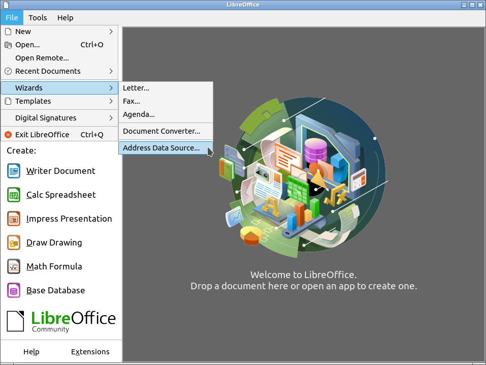
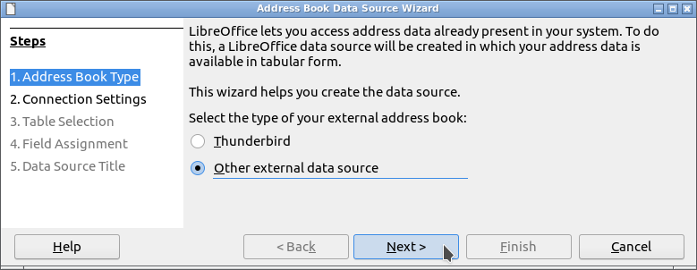
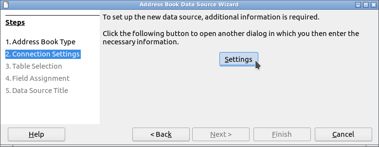
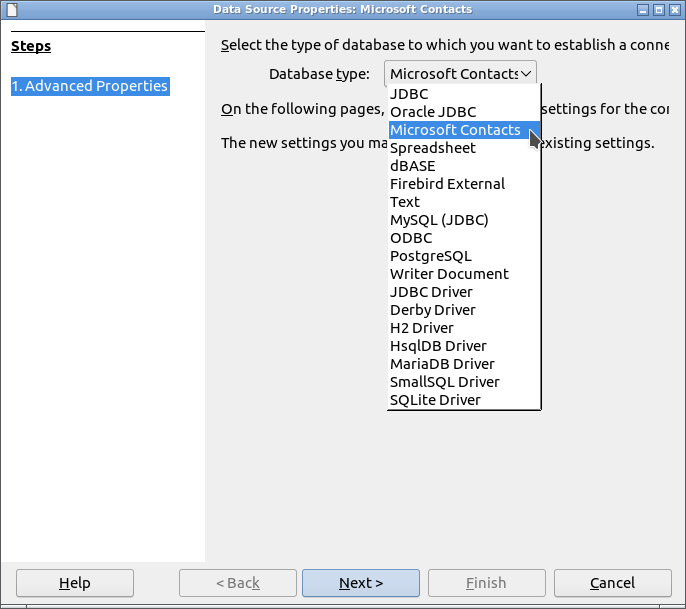
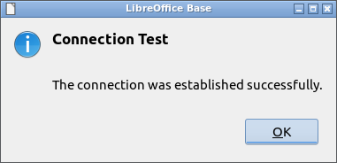

# ![mContactOOo logo][1] mContactOOo

**Ce [document][2] en français.**

**The use of this software subjects you to our** [**Terms Of Use**][3] **and** [**Data Protection Policy**][4]

# version [0.0.1][5]

## Introduction:

**mContactOOo** is part of a [Suite][6] of [LibreOffice][7] and/or [OpenOffice][8] extensions allowing to offer you innovative services in these office suites.  
This extension gives you access to your Microsoft Outlook contacts in LibreOffice / OpenOffice.

Being free software I encourage you:
- To duplicate its [source code][9].
- To make changes, corrections, improvements.
- To open [issue][10] if needed.

In short, to participate in the development of this extension.  
Because it is together that we can make Free Software smarter.

## Requirement:

mContactOOo uses a local [HsqlDB][11] database version 2.7.1.  
HsqlDB being a database written in Java, its use requires the [installation and configuration][12] in LibreOffice / OpenOffice of a **JRE version 11 or later**.  
I recommend [Adoptium][13] as your Java installation source.

If you are using **LibreOffice on Linux**, then you are subject to [bug 139538][14].  
To work around the problem, please uninstall the packages:
- libreoffice-sdbc-hsqldb
- libhsqldb1.8.0-java

If you still want to use the Embedded HsqlDB functionality provided by LibreOffice, then install the [HsqlDBembeddedOOo][15] extension.  
OpenOffice and LibreOffice on Windows are not subject to this malfunction.

## Installation:

It seems important that the file was not renamed when it was downloaded.
If necessary, rename it before installing it.

- Install ![OAuth2OOo logo][16] **[OAuth2OOo.oxt][17]** extension version 0.0.6.

You must install this extension, if it is not already installed.

- Install ![jdbcDriverOOo logo][18] **[jdbcDriverOOo.oxt][19]** extension version 0.0.4.

You must install this extension, if it is not already installed.

- Install ![mContactOOo logo][20] **[mContactOOo.oxt][21]** extension version 0.0.1.

Restart LibreOffice / OpenOffice after installation.

## Use:

In LibreOffice / OpenOffice go to File -> Wizards -> Address Data Source...:

In step: 1. Address Book Type:
- select: Other external data source
- click on: Next(Button)

In step: 2. Connection Settings:
- click on: Settings(Button)

In Database type list:
- select: Google Contacts
- click on: Next(Button)

In General: Datasource Url:
- put: your Google account (ie: your_account@gmail.com)

Then:
- click on: Test connection (button)

After authorizing the [OAuth2OOo](https://prrvchr.github.io/OAuth2OOo) application to access your Contacts, normally you should see: Connection Test: The connection was established successfully.

Have fun...

## Has been tested with:

* LibreOffice 6.4.4.2 - Ubuntu 20.04 -  LxQt 0.14.1

* LibreOffice 7.0.0.0.alpha1 - Ubuntu 20.04 -  LxQt 0.14.1

* OpenOffice 4.1.8 x86_64 - Ubuntu 20.04 - LxQt 0.14.1

* OpenOffice 4.2.0.Build:9820 x86_64 - Ubuntu 20.04 - LxQt 0.14.1

* LibreOffice 6.1.5.2 - Raspbian 10 buster - Raspberry Pi 4 Model B

* LibreOffice 6.4.4.2 (x64) - Windows 7 SP1

I encourage you in case of problem :-(  
to create an [issue](https://github.com/prrvchr/mContactOOo/issues/new)  
I will try to solve it ;-)

## Historical:

### Introduction:

This extension was written in order to make usable in free software (LibreOffice or OpenOffice) your personal data stored in your Microsoft Outlook address book.

With the [smtpMailerOOo](https://github.com/prrvchr/smtpMailerOOo/blob/master/source/smtpMailerOOo/dist/smtpMailerOOo.oxt) extension, it can be the data source for [mail merge](https://en.wikipedia.org/wiki/Mail_merge) by email, to your correspondents contained in your Microsoft Outlook adressbook.

It will give you access to an information system that only larges companies are able, today, to implement.

[1]: 
[2]: <https://prrvchr.github.io/mContactOOo/README_fr>
[3]: <https://prrvchr.github.io/mContactOOo/source/mContactOOo/registration/TermsOfUse_en>
[4]: <https://prrvchr.github.io/mContactOOo/source/mContactOOo/registration/PrivacyPolicy_en>
[5]: <https://prrvchr.github.io/mContactOOo#historical>
[6]: <https://prrvchr.github.io/>
[7]: <https://www.libreoffice.org/download/download/>
[8]: <https://www.openoffice.org/download/index.html>
[9]: <https://github.com/prrvchr/mContactOOo>
[10]: <https://github.com/prrvchr/mContactOOo/issues/new>
[11]: <http://hsqldb.org/>
[12]: <https://wiki.documentfoundation.org/Documentation/HowTo/Install_the_correct_JRE_-_LibreOffice_on_Windows_10>
[13]: <https://adoptium.net/releases.html?variant=openjdk11>
[14]: <https://bugs.documentfoundation.org/show_bug.cgi?id=139538>
[15]: <https://prrvchr.github.io/HsqlDBembeddedOOo/>
[16]: <https://prrvchr.github.io/OAuth2OOo/img/OAuth2OOo.png>
[17]: <https://github.com/prrvchr/OAuth2OOo/raw/master/OAuth2OOo.oxt>
[18]: <https://prrvchr.github.io/jdbcDriverOOo/img/jdbcDriverOOo.png>
[19]: <https://github.com/prrvchr/jdbcDriverOOo/raw/master/source/jdbcDriverOOo/dist/jdbcDriverOOo.oxt>
[20]: 
[21]: <https://github.com/prrvchr/mContactOOo/raw/master/source/mContactOOo/dist/mContactOOo.oxt>
