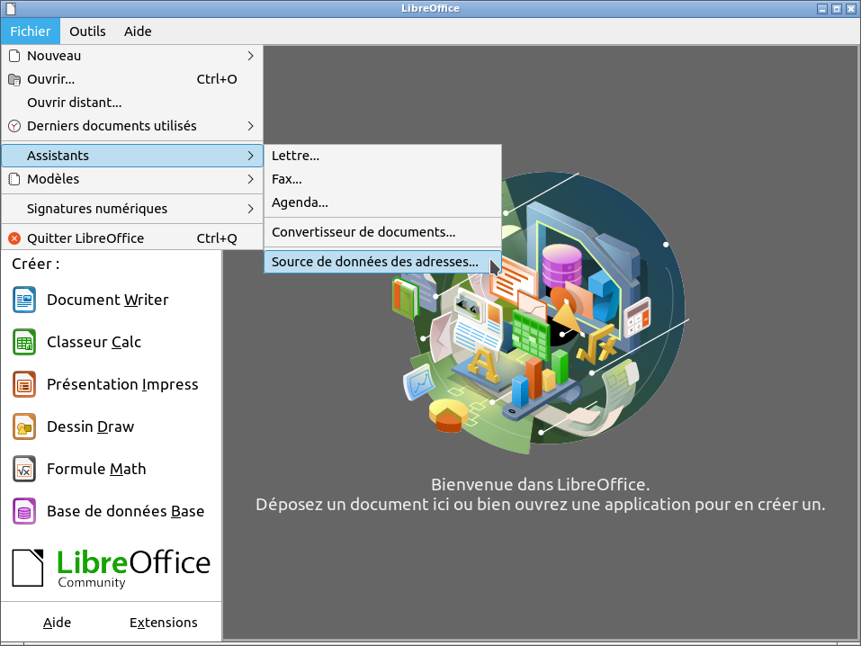
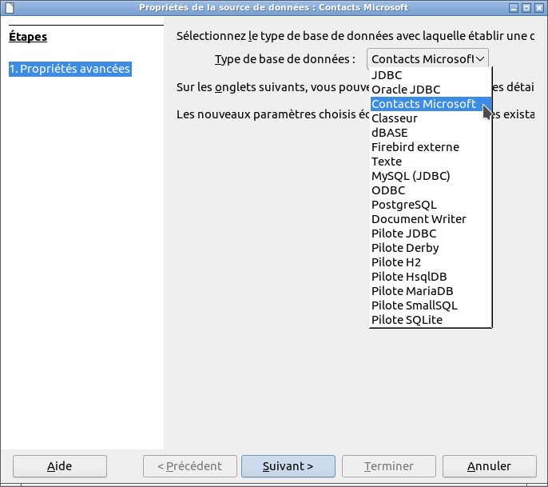
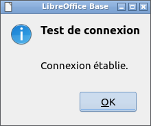

# ![mContactOOo logo][1] mContactOOo

**This [document][2] in English.**

**L'utilisation de ce logiciel vous soumet à nos** [**Conditions d'utilisation**][3] **et à notre** [**Politique de protection des données**][4]

# version [0.0.1][5]

## Introduction:

**mContactOOo** fait partie d'une [Suite][6] d'extensions [LibreOffice][7] et/ou [OpenOffice][8] permettant de vous offrir des services inovants dans ces suites bureautique.  
Cette extension vous donne l'acces à vos contacts Microsoft Outlook dans LibreOffice / OpenOffice.

Etant un logiciel libre je vous encourage:
- A dupliquer son [code source][9].
- A apporter des modifications, des corrections, des améliorations.
- D'ouvrir un [dysfonctionnement][10] si nécessaire.

Bref, à participer au developpement de cette extension.  
Car c'est ensemble que nous pouvons rendre le Logiciel Libre plus intelligent.

## Prérequis:

mContactOOo utilise une base de données locale [HsqlDB][11] version 2.7.1.  
HsqlDB étant une base de données écrite en Java, son utilisation nécessite [l'installation et la configuration][12] dans LibreOffice / OpenOffice d'un **JRE version 11 ou ultérieure**.  
Je vous recommande [Adoptium][13] comme source d'installation de Java.

Si vous utilisez **LibreOffice sous Linux**, alors vous êtes sujet au [dysfonctionnement 139538][14].  
Pour contourner le problème, veuillez désinstaller les paquets:
- libreoffice-sdbc-hsqldb
- libhsqldb1.8.0-java

Si vous souhaitez quand même utiliser la fonctionnalité HsqlDB intégré fournie par LibreOffice, alors installez l'extension [HsqlDBembeddedOOo][15].  
OpenOffice et LibreOffice sous Windows ne sont pas soumis à ce dysfonctionnement.

## Installation:

Il semble important que le fichier n'ait pas été renommé lors de son téléchargement.  
Si nécessaire, renommez-le avant de l'installer.

- Installer l'extension ![OAuth2OOo logo][16] **[OAuth2OOo.oxt][17]** version 0.0.6.

Vous devez installer cette extension, si elle n'est pas déjà installée.

- Installer l'extension ![jdbcDriverOOo logo][18] **[jdbcDriverOOo.oxt][19]** version 0.0.4.

Vous devez installer cette extension, si elle n'est pas déjà installée.

- Installer l'extension ![mContactOOo logo][20] **[mContactOOo.oxt][21]** version 0.0.1.

Redémarrez LibreOffice / OpenOffice après l'installation.

## Utilisation:

Dans LibreOffice / OpenOffice aller à: Fichier -> Assistants -> Source de données des adresses...:

À l'étape: 1. Type de carnet d'adresses:
- sélectionner: Autre source de données externes
- cliquez sur: Suivant (bouton)

À l'étape: 2. Paramètres de Connexion:
- cliquez sur: Paramètres (bouton)

Dans Type de base de données:
- sélectionner: Contacts Microsoft
- cliquez sur: Suivant (bouton)

Dans Général: URL de la source de données:
- mettre: votre compte Microsoft (c'est-à-dire: votre_compte@votre_adresse.com)

Puis:
- cliquez sur: Tester la connexion (bouton)

Après avoir autorisé l'application [OAuth2OOo](https://prrvchr.github.io/OAuth2OOo/README_fr) à accéder à vos contacts, normalement vous devez voir s'afficher: Test de connexion: Connexion établie.

Maintenant à vous d'en profiter...

## A été testé avec:

* LibreOffice 6.4.4.2 - Ubuntu 20.04 -  LxQt 0.14.1

* LibreOffice 7.0.0.0.alpha1 - Ubuntu 20.04 -  LxQt 0.14.1

* OpenOffice 4.1.8 x86_64 - Ubuntu 20.04 - LxQt 0.14.1

* OpenOffice 4.2.0.Build:9820 x86_64 - Ubuntu 20.04 - LxQt 0.14.1

* LibreOffice 6.1.5.2 - Raspbian 10 buster - Raspberry Pi 4 Model B

* LibreOffice 6.4.4.2 (x64) - Windows 7 SP1

Je vous encourage en cas de problème :-(  
de créer un [dysfonctionnement](https://github.com/prrvchr/mContactOOo/issues/new)  
J'essaierai de le résoudre ;-)

## Historique:

### Introduction:

Cette extension a été écrite afin de rendre utilisables dans un logiciel libre (LibreOffice ou OpenOffice) vos données personnelles stockées dans votre carnet d'adresses Microsoft Outlook.

Avec l'extension [smtpMailerOOo](https://github.com/prrvchr/smtpMailerOOo/blob/master/source/smtpMailerOOo/dist/smtpMailerOOo.oxt), elle peut être la source de données pour des [publipostages](https://fr.wikipedia.org/wiki/Publipostage) par courriel (email), à vos correspondants contenus dans votre carnet d'adresses Microsoft Outlook.

Elle vous donnera accès à un système d'information que seules les grandes entreprises sont capables, aujourd'hui, de mettre en œuvre.

[1]: 
[2]: <https://prrvchr.github.io/mContactOOo>
[3]: <https://prrvchr.github.io/mContactOOo/source/mContactOOo/registration/TermsOfUse_fr>
[4]: <https://prrvchr.github.io/mContactOOo/source/mContactOOo/registration/PrivacyPolicy_fr>
[5]: <https://prrvchr.github.io/mContactOOo/README_fr#historique>
[6]: <https://prrvchr.github.io/README_fr>
[7]: <https://fr.libreoffice.org/download/telecharger-libreoffice/>
[8]: <https://www.openoffice.org/fr/Telecharger/>
[9]: <https://github.com/prrvchr/mContactOOo>
[10]: <https://github.com/prrvchr/mContactOOo/issues/new>
[11]: <http://hsqldb.org/>
[12]: <https://wiki.documentfoundation.org/Documentation/HowTo/Install_the_correct_JRE_-_LibreOffice_on_Windows_10/fr>
[13]: <https://adoptium.net/releases.html?variant=openjdk11>
[14]: <https://bugs.documentfoundation.org/show_bug.cgi?id=139538>
[15]: <https://prrvchr.github.io/HsqlDBembeddedOOo/README_fr>
[16]: <https://prrvchr.github.io/OAuth2OOo/img/OAuth2OOo.png>
[17]: <https://github.com/prrvchr/OAuth2OOo/raw/master/OAuth2OOo.oxt>
[18]: <https://prrvchr.github.io/jdbcDriverOOo/img/jdbcDriverOOo.png>
[19]: <https://github.com/prrvchr/jdbcDriverOOo/raw/master/source/jdbcDriverOOo/dist/jdbcDriverOOo.oxt>
[20]: 
[21]: <https://github.com/prrvchr/mContactOOo/raw/master/source/mContactOOo/dist/mContactOOo.oxt>
